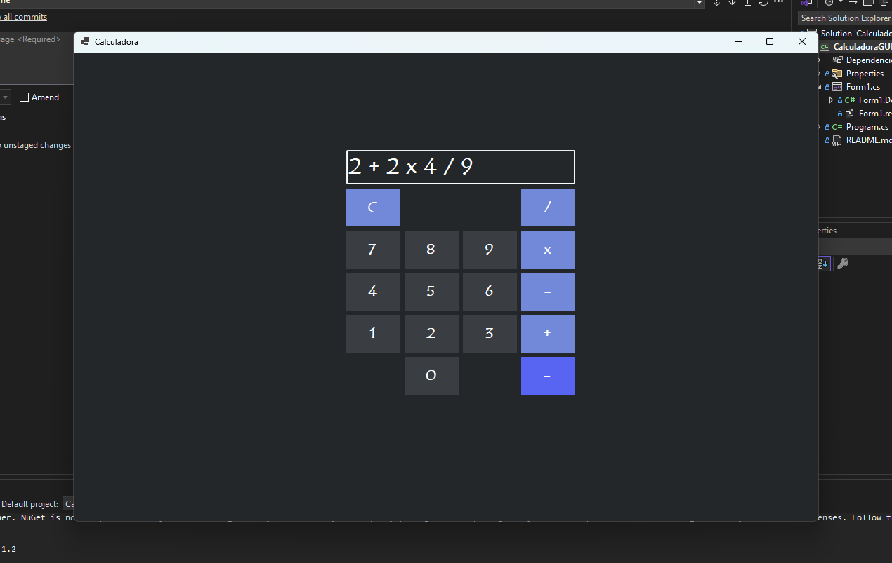

# 🖥️ Calculadora - Windows Forms App

Este projeto é uma **calculadora estilosa** desenvolvida em **C#**, utilizando o **Visual Studio** em ambiente **.NET**, com interface gráfica criada no **Windows Forms App**. Ela realiza as 4 operações básicas (adição, subtração, multiplicação e divisão) e já conta com melhorias para evitar bugs.

O principal objetivo deste projeto foi **treinar o desenvolvimento em C#**, explorando tanto a lógica de programação quanto a criação de interfaces gráficas.

---

## 📸 Pré-visualização

  

---

## 🔍 Funcionalidades

- Realiza as 4 operações matemáticas básicas:
  - Adição
  - Subtração
  - Multiplicação
  - Divisão
- Melhorias para evitar bugs em cálculos e entradas inválidas.
- Interface estilosa e fácil de usar.

---

📚 *Projeto desenvolvido como prática pessoal para aprimorar habilidades em C# e desenvolvimento com Windows Forms App.*
